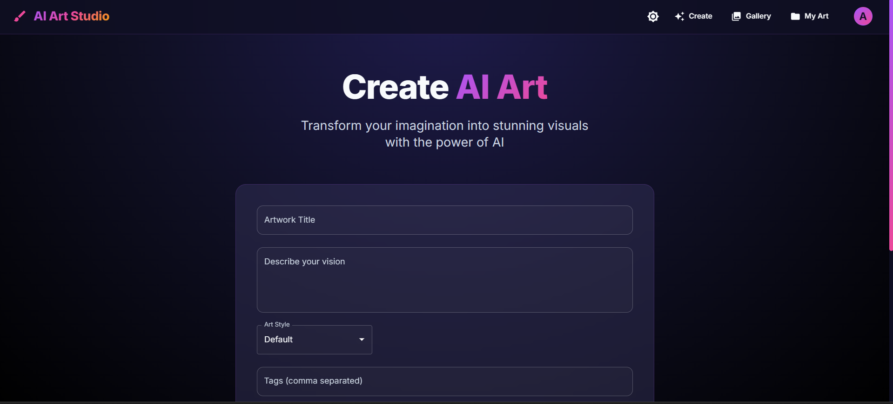
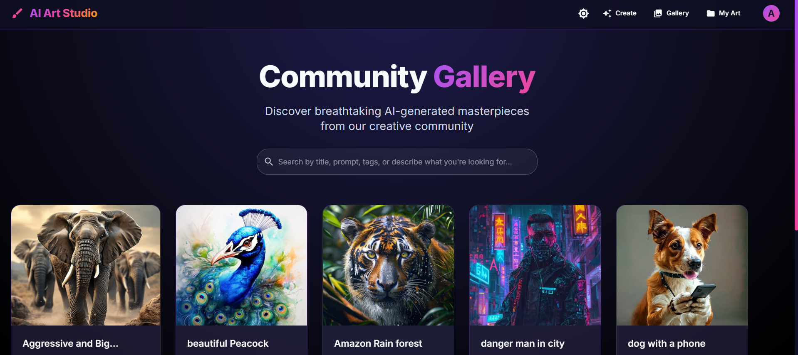
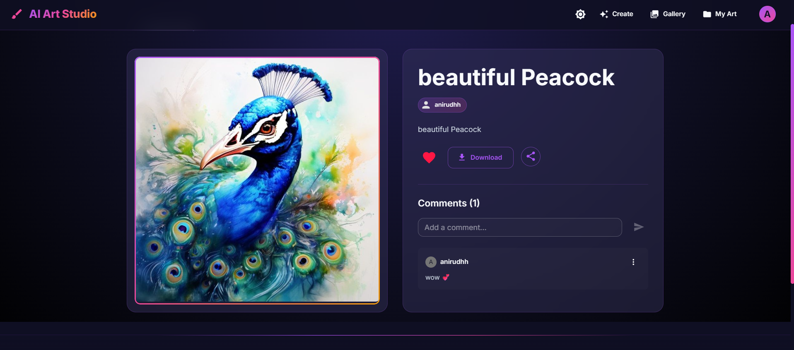

# 🎨 AI Art Studio

A full-stack web application that lets you generate stunning AI-powered artwork from text prompts, manage your personal collection, and share creations with a community gallery.

---

## 📸 Screenshots

### Home — Generate Art


### Community Gallery


### Art Detail & Comments


### Image Quality


---

## ✨ Features

- **AI Art Generation** — Describe your vision in text and generate unique artwork instantly
- **15+ Art Styles** — Van Gogh, Watercolor, Cyberpunk, Anime, Photorealistic, Oil Painting, Pixel Art, Surrealism, and more
- **Community Gallery** — Browse and discover artwork published by other users
- **Smart Search** — Fuzzy search with semantic matching across titles, prompts, and tags
- **Like System** — Like your favourite artworks in the gallery
- **Comments** — Add, edit, and delete comments on artwork detail pages
- **My Collection** — Private personal gallery to manage all your generated art
- **Publish / Unpublish** — Control which artworks appear in the public gallery
- **Remix** — Take any artwork's prompt and style as a starting point for your own creation
- **Download** — Save any artwork directly to your device
- **Share** — Share artwork links via native share or clipboard copy
- **Edit Title** — Rename your artworks anytime
- **Delete Art** — Remove artworks from your collection
- **User Authentication** — Register, login, and secure JWT-based sessions
- **Admin Dashboard** — View platform stats (users, artworks, likes, comments) and manage users
- **Dark / Light Mode** — Toggle between themes with smooth transitions
- **Fully Responsive** — Works seamlessly on mobile, tablet, and desktop

---

## 🛠 Tech Stack

**Frontend**
- React 18 + Vite
- Material-UI (MUI v7)
- Framer Motion (animations)
- React Router v7
- Axios

**Backend**
- Node.js + Express
- MongoDB + Mongoose
- JWT Authentication
- bcryptjs (password hashing)
- express-validator

---

## 📦 Installation

### Prerequisites
- Node.js v18+
- MongoDB running locally or a MongoDB Atlas URI

### 1. Clone the repo
```bash
git clone https://github.com/anirudhhbehera/Ai-Art-Generator.git
cd Ai-Art-Generator
```

### 2. Setup Server
```bash
cd server
npm install
```

Create a `.env` file inside `server/`:
```env
MONGODB_URI=mongodb://localhost:27017/ai-art-gallery
JWT_SECRET=your_jwt_secret_here
PORT=5000
```

### 3. Setup Client
```bash
cd ../client
npm install
```

---

## 🚀 Running the App

**Start MongoDB** (if running locally):
```bash
mongod
```

**Start the backend** (from `server/`):
```bash
npm start
```
> Runs on http://localhost:5000

**Start the frontend** (from `client/`):
```bash
npm run dev
```
> Runs on http://localhost:5173

---

## 🗂 Project Structure

```
AI-Art-Studio/
├── client/                 # React frontend
│   └── src/
│       ├── components/     # Navbar, Footer, Login, Register
│       ├── context/        # Auth context
│       └── pages/          # Home, Gallery, ArtDetail, MyCollection, Admin
├── server/                 # Express backend
│   ├── middleware/         # JWT auth middleware
│   ├── models/             # Mongoose models (User, Art)
│   └── routes/             # API routes
└── images/                 # Project screenshots
```

---

## 🔌 API Endpoints

| Method | Endpoint | Description |
|--------|----------|-------------|
| POST | `/api/auth/register` | Register a new user |
| POST | `/api/auth/login` | Login |
| GET | `/api/auth/profile` | Get current user profile |
| POST | `/api/art/generate` | Generate AI art |
| POST | `/api/art/save` | Save art to collection (private) |
| POST | `/api/art/publish` | Save and publish to gallery |
| GET | `/api/art/gallery` | Get all public artworks |
| GET | `/api/art/my-collection` | Get user's own artworks |
| PATCH | `/api/art/:id/like` | Like / unlike an artwork |
| PATCH | `/api/art/:id/toggle-publish` | Toggle public/private |
| PATCH | `/api/art/:id/title` | Update artwork title |
| POST | `/api/art/:id/comment` | Add a comment |
| PATCH | `/api/art/:id/comment/:cid` | Edit a comment |
| DELETE | `/api/art/:id/comment/:cid` | Delete a comment |
| POST | `/api/art/:id/remix` | Remix an artwork |
| DELETE | `/api/art/:id` | Delete own artwork |
| GET | `/api/admin/stats` | Admin — platform stats |
| GET | `/api/admin/users` | Admin — all users |
| PATCH | `/api/admin/users/:id/ban` | Admin — ban/unban user |

---

## 📄 License

MIT License — free to use and modify.
